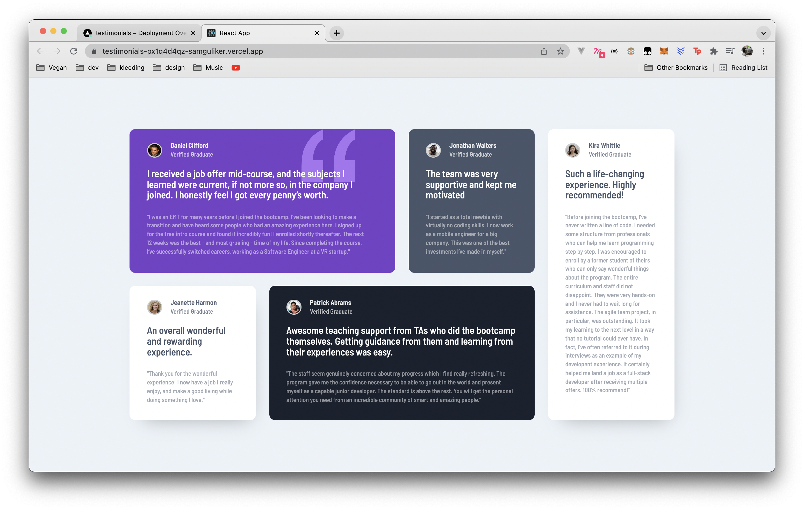

# Frontend Mentor - Testimonials grid section solution
Hi there :wave:

This is a solution to the [Testimonials grid section challenge on Frontend Mentor](https://www.frontendmentor.io/challenges/testimonials-grid-section-Nnw6J7Un7). Frontend Mentor challenges help you improve your coding skills by building realistic projects. 

## Table of contents

- [Overview](#overview)
  - [The challenge](#the-challenge)
  - [Screenshot](#screenshot)
  - [Links](#links)
- [My process](#my-process)
  - [Built with](#built-with)
  - [What I learned](#what-i-learned)
- [Author](#author)
- [Acknowledgments](#acknowledgments)

## Overview

### The challenge

Users should be able to:

- View the optimal layout for the site depending on their device's screen size

### Screenshot



### Links

- [Solution](https://your-solution-url.com)
- [Live Site URL](https://testimonials-px1q4d4qz-samguliker.vercel.app/)

## My process

### Built with

- Semantic HTML5 markup
- CSS custom properties
- Flexbox
- CSS Grid
- Mobile-first workflow
- [React](https://reactjs.org/) - JS library
- [Typesript.tsx](https://www.typescriptlang.org/docs/handbook/jsx.html) - JS library

### What I learned

Working with typescript I found out that I can use a container function that
renders it children components. Next to that I'm happy with the result creating a 
oneliner for it.

To see how you can add code snippets, see below:

```js
import React, { ReactNode } from 'react'

type TestimonialProps = { children: ReactNode }

const TestimonialContainer = ({children}: TestimonialProps): JSX.Element | null => <main className="main">{children}</main>

export default TestimonialContainer
}
```

## Author

- Website - [Sam Guliker](https://www.samguliker.nl/)
- Frontend Mentor - [@Sam-Guliker](https://www.frontendmentor.io/profile/Sam-Guliker)